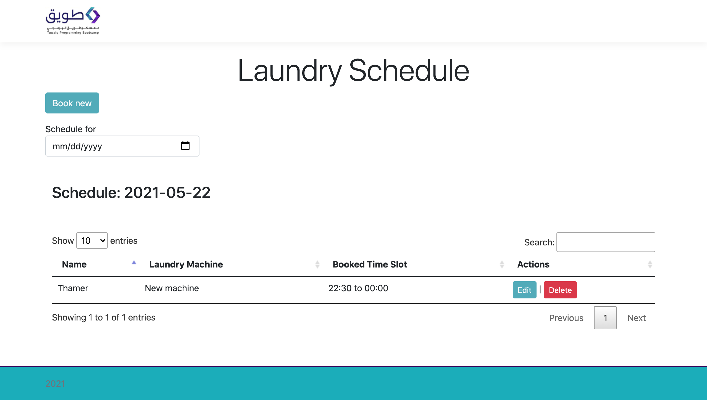
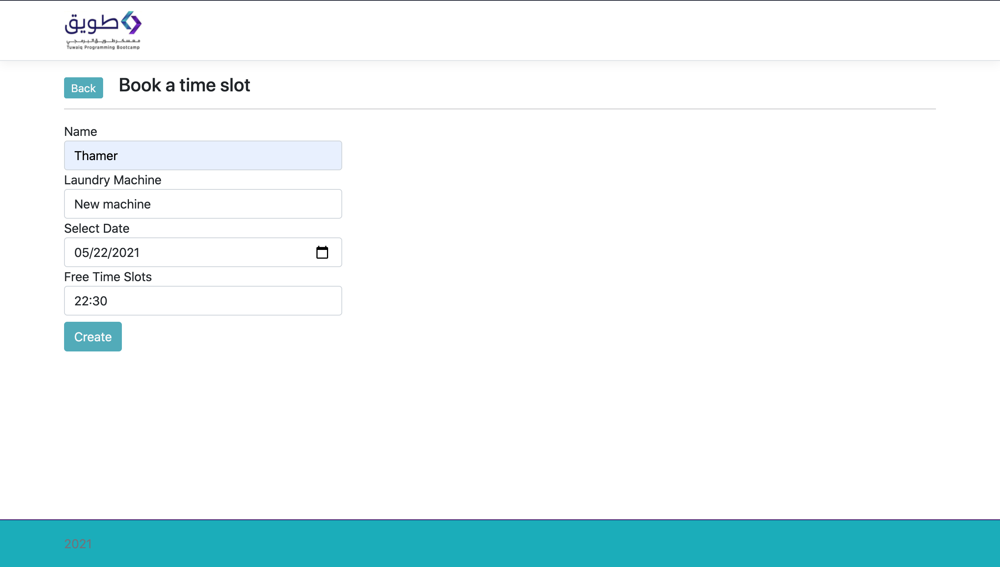

# laundryScheduling

## Description 
This project was initiated to solve a real-life problem within the academy housing, the laundry room busy all weekend, sometimes people forget to take their clothes out and we don't know to whom it belongs, also, we had to check our selves if the laundry machine is free or not.

With this simple scheduling website, trainees agreed to make it easier for everyone, and save our time doing stuff that matters more

### screen shots

